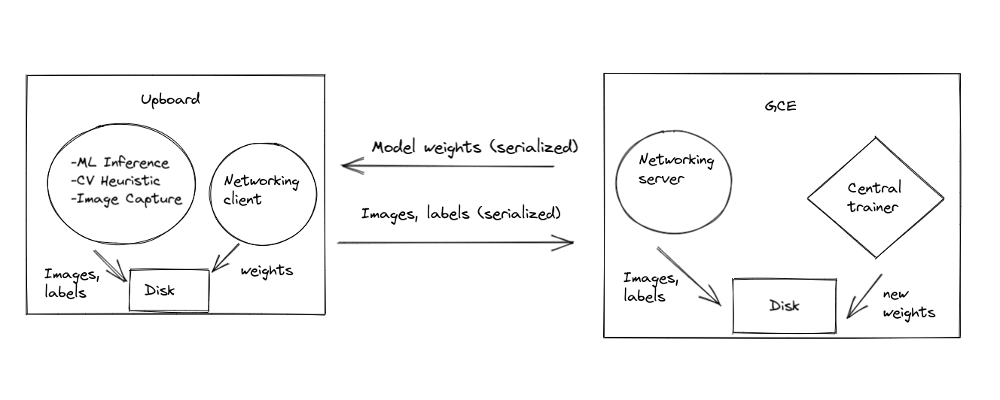

# Networking Stack for Centralized Learning

Here is our network architecture diagram for how we are performing centralized learning with edge devices.



We use Rust for the network communication between edge client and central server, sending data through TCP sockets.
We use the disk to perform IPC between processes on the client and server.
These processes will use a Python3 wrapper to read/write data to the disk which is then picked up by the networking code and sent/received.

## Installation
First install Rust with
```
curl --proto '=https' --tlsv1.2 -sSf https://sh.rustup.rs | sh
```
Then run 
```
cargo run --bin server
```
to start the server-side networking node and
```
cargo run --bin client
```
to start the client-side networking node.

Finally, interface with the networking node using Python functions inside of `data_utils.py`:
```
read_new_images(last_time: float) -> Tuple[List[Tuple[np.ndarray, Any]], float]
write_image(image: np.ndarray, label: Any)
load_weights(model: keras.Model, last_time: float) -> Tuple[bool, float]
save_weights(model: keras.Model)
```
The documentation for these functions are in their docstrings.
